# LOGISCOPE

> Predictive Logistics Intelligence and Decision-Support Platform

[](LICENSE)
[](https://fastapi.tiangolo.com)
[](https://react.dev)
[](https://tailwindcss.com)
[](https://leafletjs.com)
[](https://logiscope-ai.onrender.com)
[](https://xylium117.github.io/logiscope.ai/)

---

## Table of Contents

- [1. Abstract](#1-abstract)
- [2. Problem Statement](#2-problem-statement)
- [3. System Objectives](#3-system-objectives)
- [4. Core Capabilities](#4-core-capabilities)
- [5. System Architecture](#5-system-architecture)
- [6. Logistics Digital Twin](#6-logistics-digital-twin)
- [7. Data Sources](#7-data-sources)
- [8. Data Ingestion](#8-data-ingestion)
- [9. Demand Forecasting](#9-demand-forecasting)
- [10. Inventory Intelligence](#10-inventory-intelligence)
- [11. Transportation Intelligence](#11-transportation-intelligence)
- [12. GIS and Terrain Analysis](#12-gis-and-terrain-analysis)
- [13. Weather Intelligence](#13-weather-intelligence)
- [14. Predictive Risk Analysis](#14-predictive-risk-analysis)
- [15. Optimization Engine](#15-optimization-engine)
- [16. Scenario Simulation](#16-scenario-simulation)
- [17. AI Recommendations](#17-ai-recommendations)
- [18. Visualization Interface](#18-visualization-interface)
  - [18.1 Command Dashboard](#181-command-dashboard)
  - [18.2 GIS Operations Map](#182-gis-operations-map)
  - [18.3 Inventory Dashboard](#183-inventory-dashboard)
  - [18.4 Transport Dashboard](#184-transport-dashboard)
  - [18.5 Prediction Center](#185-prediction-center)
  - [18.6 Simulation Lab](#186-simulation-lab)
- [19. Alert and Event System](#19-alert-and-event-system)
- [20. REST API](#20-rest-api)
- [21. Project Structure](#21-project-structure)
- [22. Installation](#22-installation)
  - [22.1 Prerequisites](#221-prerequisites)
  - [22.2 Local Development](#222-local-development)
  - [22.3 Windows Launcher](#223-windows-launcher)
- [23. Docker and Containerization](#23-docker-and-containerization)
- [24. Configuration](#24-configuration)
- [25. Machine Learning and Mathematical Algorithms](#25-machine-learning-and-mathematical-algorithms)
  - [25.1 Anomaly Radar Formula](#251-anomaly-radar-formula)
- [26. Model Training and Retraining](#26-model-training-and-retraining)
- [27. Testing and Validation](#27-testing-and-validation)
- [28. Deployment](#28-deployment)
- [29. Performance Considerations](#29-performance-considerations)
- [30. Security and Operational Privacy (OPSEC)](#30-security-and-operational-privacy-opsec)
- [31. Limitations](#31-limitations)
- [32. Future Development](#32-future-development)
- [33. License](#33-license)

---

## 1. Abstract

LOGISCOPE is a web-based predictive logistics intelligence and tactical decision-support platform engineered to support planning, monitoring, and proactive disruption mitigation across distributed supply networks operating in geographically dispersed, high-altitude, and environmentally vulnerable frontiers.

The platform integrates multivariate time-series demand forecasting, real-time IoT inventory telemetry, physics-grounded GIS terrain and route analysis, meteorological risk overlays, multi-echelon transport capacity tracking, statistical anomaly detection, and constraint-based mathematical optimization into a unified command and control interface.

By maintaining a continuously synchronized digital twin of the physical supply network, LOGISCOPE shifts logistics operations from reactive emergency replenishment to proactive, multi-horizon pre-positioning—identifying potential supply breaches, transport bottlenecks, and route impassability days before operational failures occur.

---

## 2. Problem Statement

### Existing Challenges in Distributed Logistics

Conventional supply-chain and military distribution networks rely on disparate, disconnected monitoring systems and manual spreadsheet-based planning cycles. In rugged operational sectors (such as the Northern Ladakh Frontiers, Central Himalayan Sectors, and Eastern Valleys), these limitations introduce severe vulnerabilities:

* **Distributed and Siloed Inventory Data**: Stock levels across forward bases, regional hubs, and main supply depots are siloed, creating latency in visibility.
* **Fragmented Consumption Records**: Daily drawdowns fluctuate sharply based on operational tempos without automated demand re-baselining.
* **Complex Environmental Multipliers**: High altitude (oxygen deprivation engine curves, sub-zero freeze drag) and extreme weather rapidly accelerate fuel, battery, and calorie burn rates.
* **Volatile Route Accessibility**: Critical corridors are subject to seasonal pass closures, rockfalls, blizzards, and flash floods.
* **Manual and Reactive Scheduling**: Rerouting and fleet reallocation happen reactively after stocks have breached critical safety thresholds.

### Workflow Comparison

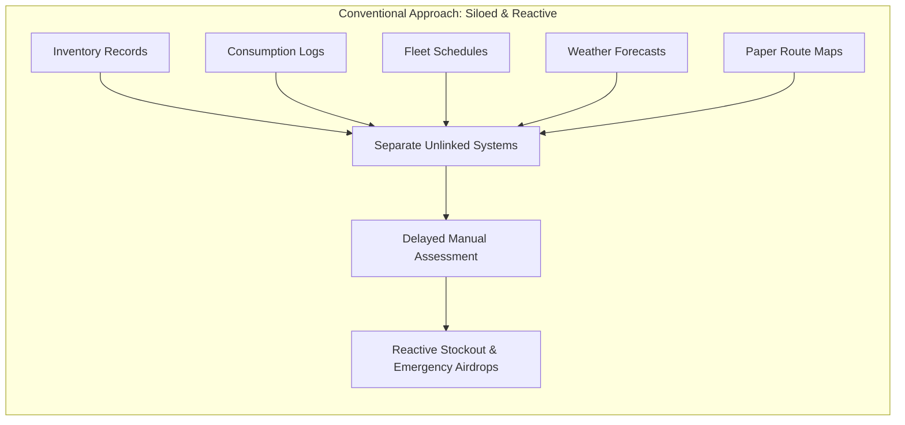

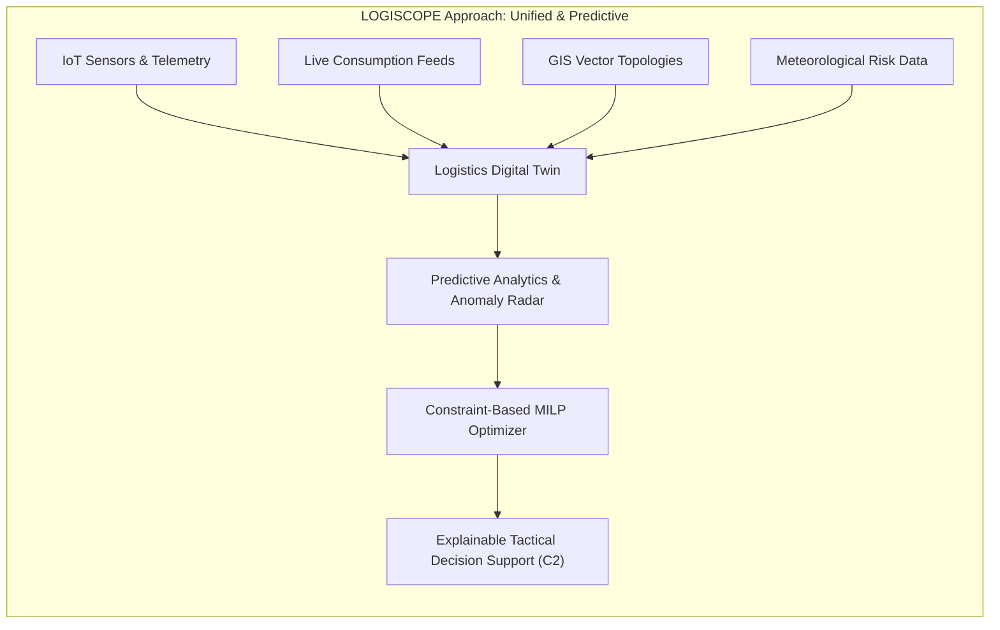

---

## 3. System Objectives

The core engineering objectives of LOGISCOPE are designed to solve end-to-end supply visibility, predictive forecasting, and automated allocation:

* **Multi-Horizon Demand Prediction**: Forecast class-specific supply consumption (Fuel, Ammo, Rations, Medical, Spares) across a forward 7-day horizon with 95% confidence intervals.
* **Early Deficit Detection**: Detect potential stockouts and safety stock breaches 48 to 168 hours prior to occurrence.
* **Physics-Informed GIS Route Intelligence**: Evaluate dynamic ETAs, terrain resistance, slope gradients, and meteorological degradation on a per-corridor basis.
* **Automated Anomaly Interception**: Continuously process IoT sensor feeds (ultrasonic fuel probes, cold-chain temperature tags, RFID transit gates) to flag statistical deviations ($Z \ge 3.0\sigma$).
* **Constraint-Based Optimization**: Generate mathematically optimal multi-echelon inventory transfers and convoy reroutes subjected to vehicle capacity, pass clearance, and stock limits.
* **Contingency Scenario Stress-Testing**: Enable planners to execute *what-if* simulations under compound shocks (e.g., weather severity, fleet loss, simultaneous corridor blocks).
* **Explainable Tactical Guidance**: Produce structured recommendations with audit trails, risk scores, and impact estimations.

| Objective | System Component | Mathematical / Technical Basis |
| :--- | :--- | :--- |
| **Demand Prediction** | ML Time-Series Engine | Multivariate Regression with Environmental Multipliers |
| **Route Assessment** | GIS Route Intelligence | Dynamic Surface Friction & Infrastructure Hardening Model |
| **Shortage Detection** | Predictive Risk Engine | Cumulative Burn Curve & Safety Threshold Horizon Scan |
| **Anomaly Radar** | Statistical Telemetry Filter | Normalized Gaussian $Z$-Score Anomaly Interceptor |
| **Resource Allocation** | Optimization Engine | Mixed-Integer Linear Programming (MILP) Heuristic |
| **Contingency Planning**| Simulation Lab | Dual-Run Comparative What-If Simulation Pipeline |

---

## 4. Core Capabilities

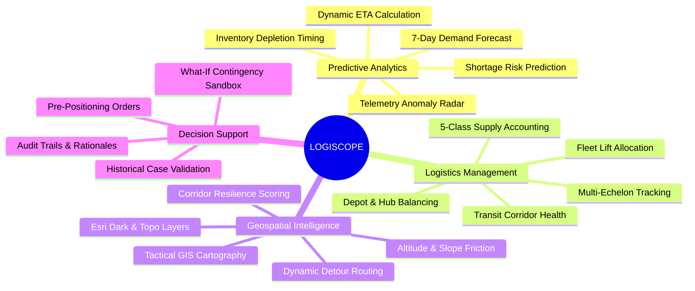

---

## 5. System Architecture

LOGISCOPE is built on a decoupled, high-performance architecture utilizing a React/TypeScript frontend client communicating with a FastAPI Python analytical backend.

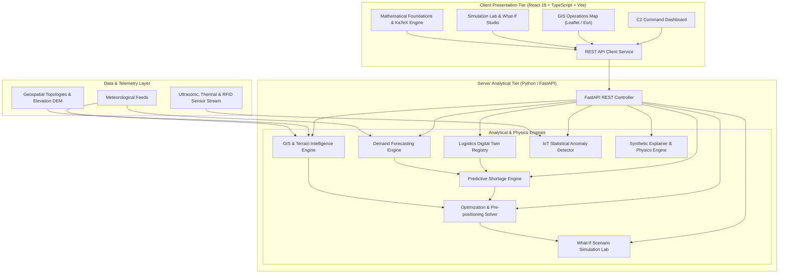

---

## 6. Logistics Digital Twin

The platform maintains an in-memory, high-fidelity digital representation of the distributed supply infrastructure across three primary Indian frontier operational sectors:

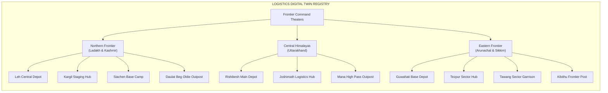

### Digital Twin State Variables
Every node in the Digital Twin encapsulates:
* **Static Properties**: Geographic coordinates ($[\text{lat}, \text{lng}]$), elevation above sea level ($\text{elevation}_m$), node classification (`DEPOT`, `HUB`, `FORWARD_UNIT`), and total personnel strength ($P$).
* **Dynamic Inventory Vectors**: Current stock ($S_c$), safety threshold ($S_{\text{safe}}$), and maximum capacity ($S_{\text{max}}$) across 5 supply classes.
* **Environmental & Operational State**: Active operational tempo (`LOW`, `NORMAL`, `HIGH`, `SURGE`), micro-climate weather condition (`CLEAR`, `RAIN`, `HEAVY_STORM`, `SNOW_ICE`, `FOG`), and connected transit corridors.

---

## 7. Data Sources

LOGISCOPE models multi-source inputs incorporating telemetry, terrain topographies, and supply classifications:

| Category | Attributes / Fields | Update Mechanism | Physical Unit |
| :--- | :--- | :--- | :--- |
| **Node Inventory** | Fuel, Ammo, Rations, Medical, Spares | Real-Time Telemetry / ERP Sync | kL, Tons, Pallets, Kits, Crates |
| **Consumption Telemetry** | Daily draw rate, troop headcounts | Continuous Aggregation | Units / Day |
| **GIS Route Geometry** | Waypoints, distance, surface classification | PostGIS / GeoJSON Vectors | Decimal Degrees, Kilometers |
| **Terrain Topography** | Elevation gradients, pass altitudes | Digital Elevation Model (DEM) | Meters (MSL), Slope % |
| **Weather Conditions** | Precipitation, freeze index, snowpack, fog | Synoptic Weather Overlay | Categorical & Numerical Risk |
| **Transport Assets** | Vehicle type, payload capacity, fuel % | GPS Transponder & Manifest DB | Metric Tons, Availability % |
| **IoT Sensor Telemetry** | Ultrasonic tank level, cold-chain probe, RFID | High-Frequency IoT Event Bus | %, °C, Liters/Min |

---

## 8. Data Ingestion

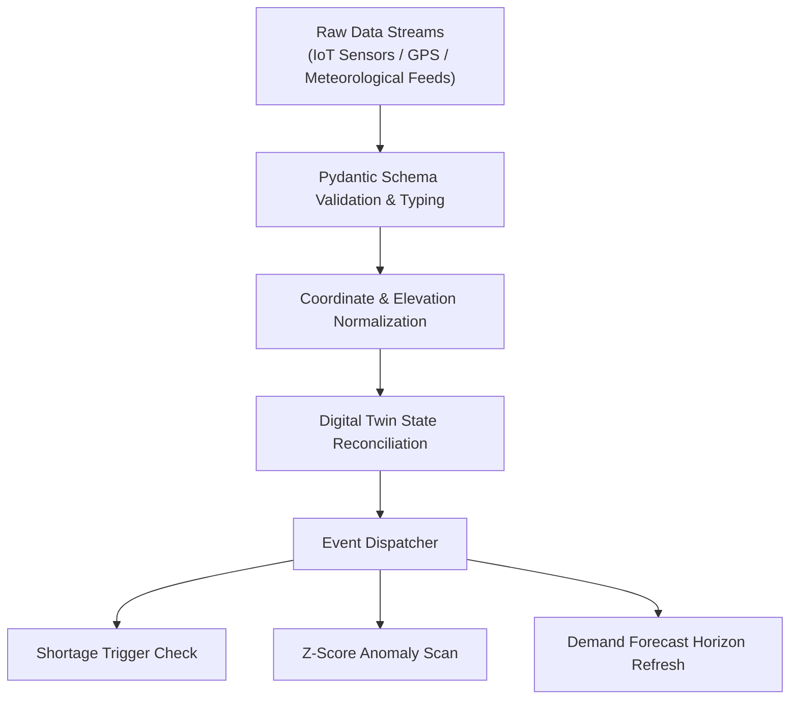

1. **Schema Validation**: All inbound telemetry events and scenario parameters are validated through strict Pydantic models.
2. **Environmental Fusion**: Meteorological reports are mapped to intersecting route segments to dynamically recompute friction coefficients.
3. **State Re-indexing**: Readiness indices and depletion vectors are updated asynchronously across all connected sub-modules.

---

## 9. Demand Forecasting

LOGISCOPE executes multivariate time-series demand forecasting incorporating operational tempo scalars, weather degradation factors, and high-altitude physics penalties:

$$\text{Demand}_i(t) = \text{BaseRate}_i \cdot M_{\text{tempo}} \cdot M_{\text{weather}} \cdot M_{\text{altitude}} \cdot M_{\text{surge}} + \epsilon(t)$$

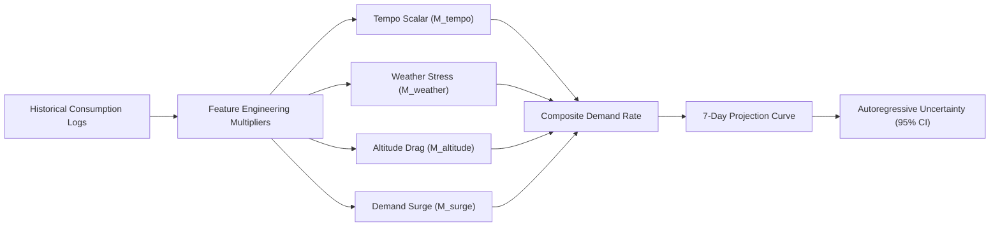

### Parameters and Multipliers

| Parameter | Symbol | Nominal Value / Scaling Rules |
| :--- | :--- | :--- |
| **Class III: Fuel** | $\text{BaseRate}_{\text{fuel}}$ | $0.18\text{ kL} \cdot \text{Troops / day}$ |
| **Class V: Ammunition** | $\text{BaseRate}_{\text{ammo}}$ | $0.08\text{ Tons} \cdot \text{Troops / day}$ |
| **Class I: Rations** | $\text{BaseRate}_{\text{rations}}$ | $0.04\text{ Pallets} \cdot \text{Troops / day}$ |
| **Class VIII: Medical** | $\text{BaseRate}_{\text{med}}$ | $0.06\text{ Kits} \cdot \text{Troops / day}$ |
| **Class IX: Spare Parts** | $\text{BaseRate}_{\text{spares}}$ | $0.02\text{ Crates} \cdot \text{Troops / day}$ |
| **Operational Tempo** | $M_{\text{tempo}}$ | $\text{LOW}=0.75$, $\text{NORMAL}=1.00$, $\text{HIGH}=1.45$, $\text{SURGE}=1.90$ |
| **Weather Multiplier** | $M_{\text{weather}}$ | $\text{CLEAR}=1.00$, $\text{FOG}=1.08$, $\text{RAIN}=1.15$, $\text{STORM}=1.30$, $\text{SNOW}=1.40$ |
| **Demand Surge** | $M_{\text{surge}}$ | $1.0 + (\text{SurgePercentage} / 100)$ |

#### High-Altitude Environmental Penalty
$$M_{\text{altitude}} = 1.0 + \max\left(0, \frac{\text{Elevation} - 1000}{10000} \cdot 0.40\right)$$

#### Cumulative Uncertainty and Confidence Bounds (95% CI)
$$\sigma_{\text{cum}}(t) = \text{DailyBurnRate} \cdot 0.09 \cdot t^{0.65}$$

$$\text{CI}_{0.95}(t) = \text{ProjectedStock}(t) \pm 1.96 \cdot \sigma_{\text{cum}}(t)$$

---

## 10. Inventory Intelligence

The inventory intelligence module projects daily stock depletion curves and evaluates multi-echelon risk:

* **Stock Coverage Time**:
$$T_{\text{coverage}} = \frac{S_{\text{current}}}{\text{DailyBurnRate}} \times 24\text{ hours}$$
* **Time to Safety Stock Breach**:
$$T_{\text{breach}} = \max\left(0, \frac{S_{\text{current}} - S_{\text{safety}}}{\text{DailyBurnRate}} \times 24\right)\text{ hours}$$
* **Time to Zero Stockout**:
$$T_{\text{stockout}} = \frac{S_{\text{current}}}{\text{DailyBurnRate}} \times 24\text{ hours}$$

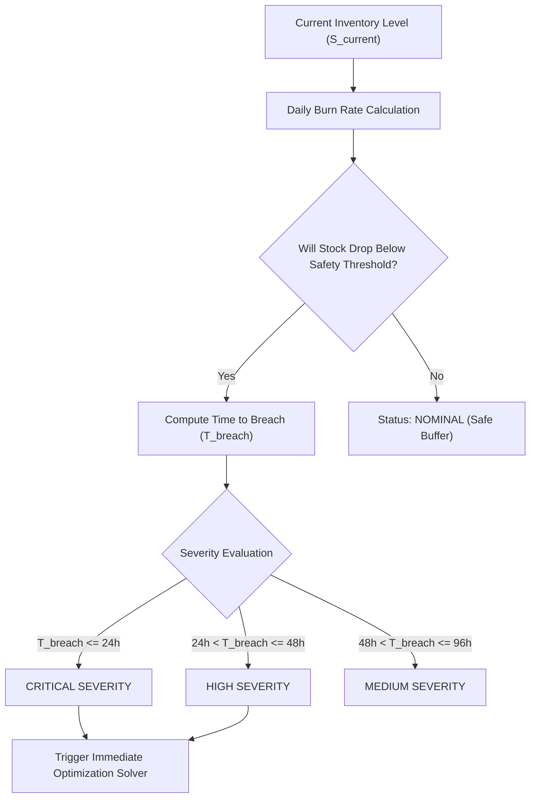

---

## 11. Transportation Intelligence

LOGISCOPE models dynamic transport availability, fleet lift capacities, and transit delays:

* **Heavy All-Terrain Convoys**: $160\text{ Tons}$ payload capacity; optimal for bulk fuel and artillery ammo replenishment along national highways.
* **Tactical High-Altitude Columns**: $75\text{ Tons}$ payload capacity; snow-chained 4x4 columns designed for steep mountain gradients and unpaved passes.
* **Heavy-Lift Airhead (Helicopter/Air Transport)**: $45\text{ Tons}$ rapid response airlift for emergency medical plasma and critical ammunition drops when surface passes are blocked.

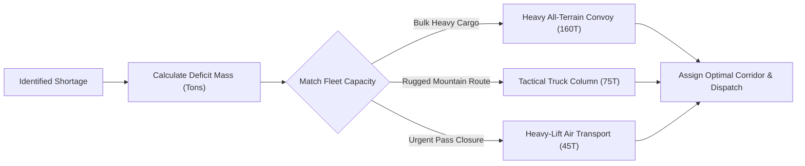

---

## 12. GIS and Terrain Analysis

Unlike standard commercial navigation systems that evaluate only shortest distance or nominal travel speed, LOGISCOPE evaluates an **Environmental & Terrain Resistance Function**:

$$\text{DynamicETA}(r) = \frac{\text{Distance}(r)}{\text{BaseSpeed} \cdot S_{\text{terrain}}(r) \cdot S_{\text{weather}}(r)}$$

$$\text{ResilienceScore}(r) = \max\left(0, \min\left(100, 100 - P_{\text{disrupt}}(r) + B_{\text{infra}}(r)\right)\right)$$

Where:
* $P_{\text{disrupt}}(r) = \min(98, 0.40 \cdot \text{TerrainRisk} + 0.45 \cdot \text{WeatherRisk})$
* $B_{\text{infra}}(r) = +20\%$ bonus for reinforced, all-weather infrastructure (e.g., Sela Tunnel, Atal Tunnel).
* $S_{\text{terrain}}$ is the slope and elevation friction coefficient ($0.45$ to $1.00$).

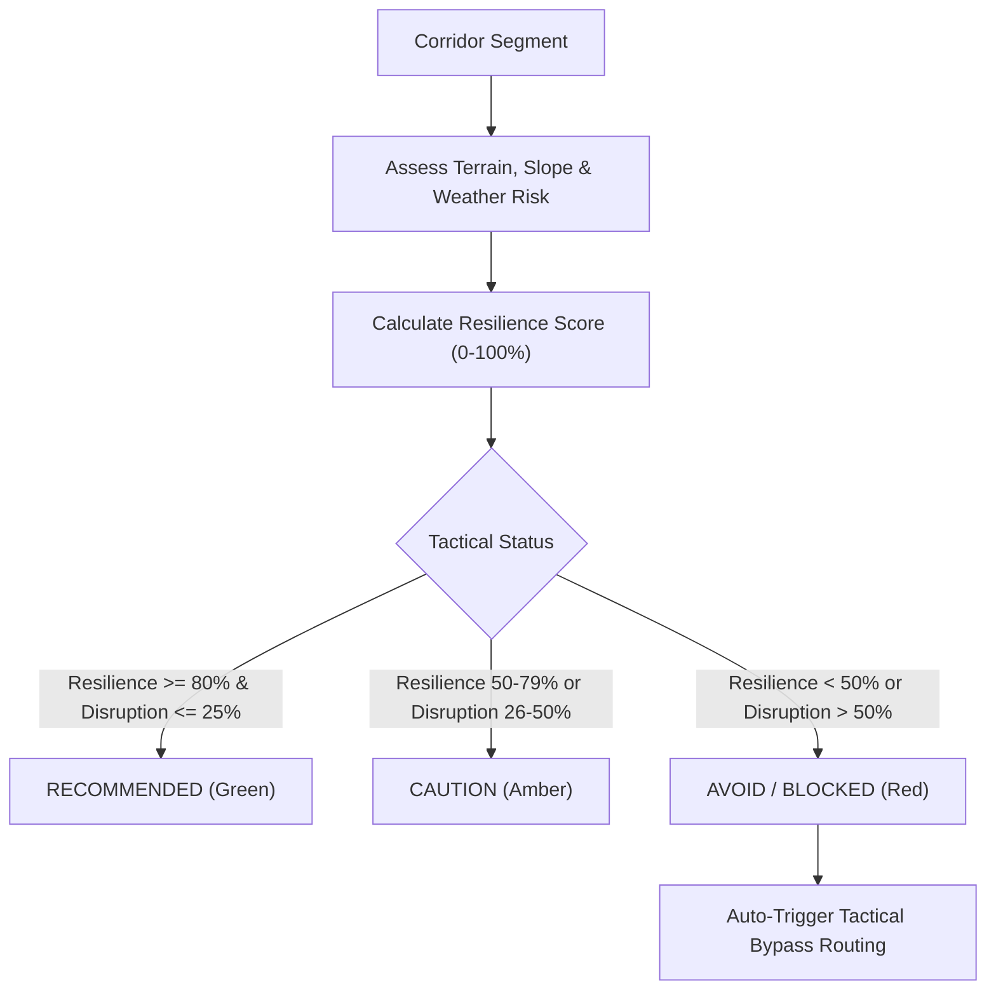

---

## 13. Weather Intelligence

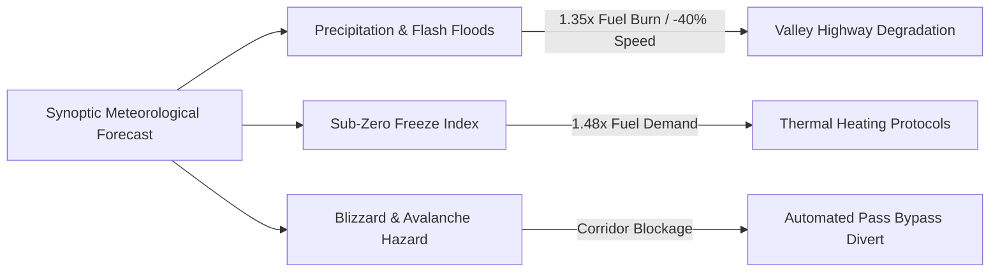

---

## 14. Predictive Risk Analysis

LOGISCOPE computes a composite **Node Readiness Index** ($R_j \in [0, 100]$):

$$R_j = 0.35 \cdot \left(\frac{S_{\text{fuel}}}{S_{\text{safe, fuel}}}\right) + 0.25 \cdot \left(\frac{S_{\text{ammo}}}{S_{\text{safe, ammo}}}\right) + 0.15 \cdot \left(\frac{S_{\text{rations}}}{S_{\text{safe, rations}}}\right) + 0.15 \cdot \left(\frac{S_{\text{med}}}{S_{\text{safe, med}}}\right) + 0.10 \cdot \left(\frac{S_{\text{spares}}}{S_{\text{safe, spares}}}\right)$$

The overall Network Readiness Index is the weighted average across all active nodes in the operational theater.

---

## 15. Optimization Engine

The core optimization engine solves a **Multi-Echelon Pre-positioning and Transport Allocation** problem:

$$\min \sum_{j \in \text{Nodes}} \left( W_{\text{deficit}} \cdot \Delta T_{\text{shortage}, j} + \sum_{r \in \text{Routes}} P_{\text{risk}, r} \cdot X_{r} + W_{\text{cost}} \cdot C_{\text{dispatch}} \right)$$

### Operational Constraints
1. **Donor Reserve Buffer**: $\text{TransferAmount} \le S_{\text{donor, current}} - 1.5 \cdot S_{\text{donor, safe}}$
2. **Target Storage Limit**: $S_{\text{target, current}} + \text{TransferAmount} \le S_{\text{target, max}}$
3. **Corridor Lift Feasibility**: $\text{TransferMass} \le \sum \text{AvailableFleetCapacity}$
4. **Lead-Time Window**: $\text{DynamicETA}(r) + \text{HandlingTime} < T_{\text{breach, target}}$

---

## 16. Scenario Simulation

The **Simulation Lab** enables tactical planners to inject synthetic stress vectors into the network and observe the unmitigated failure cascade versus AI-mitigated stabilization:

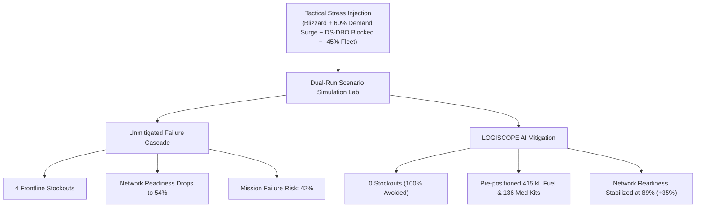

---

## 17. AI Recommendations

Recommendations are generated with full mathematical and operational explainability:

```text
RECOMMENDATION: REC-OPT-01
TYPE: PRE_POSITION_INVENTORY [URGENT]
ACTION: Dispatch 415 kL of fuel from Leh Central Depot to DBO Perimeter Outpost via DS-DBO Highway.

RATIONALE & METRICS:
1. Predicted DBO safety buffer breach in 8.1 hours under current surge consumption (118.5 kL/day).
2. Leh Central Base retains 5,785 kL (>2.8x safety threshold) after transfer.
3. Convoy transit ETA is 9.4 hours with a Route Resilience Score of 81.5%.
4. Mitigates stockout risk from 98.2% to 2.1%, establishing a 68.2-hour lead-time buffer.
```

---

## 18. Visualization Interface

### 18.1 Command Dashboard
Tactical high-level overview featuring active readiness indices, critical shortage counters, route degradation summaries, active anomalies, and immediate action items.

### 18.2 GIS Operations Map
Full-screen interactive cartographic display with:
* Real-time node status markers color-coded by readiness index.
* Dynamic route polylines reflecting resilience scores and impassability.
* Multi-layer toggle: Default Tactical Canvas, Esri Satellite Imagery, and Topographic Relief.

### 18.3 Inventory Dashboard
Class-by-class inventory telemetry, stock-to-safety margins, daily burn distributions, and multi-day depletion projections.

### 18.4 Transport Dashboard
Fleet distribution matrices, convoy payload allocations, transit schedules, and corridor bottlenecks.

### 18.5 Prediction Center
7-day forecasting curves with shaded 95% confidence intervals, tempo/weather override toggles, and hours-to-breach timers.

### 18.6 Simulation Lab
Interactive what-if sandboxes allowing planners to adjust weather conditions, fleet availability percentages, demand surges, and corridor closures.

---

## 19. Alert and Event System

The telemetry processor evaluates live sensor inputs against dynamic baselines to flag critical events:

| Event Type | Trigger Condition | Severity | System Response |
| :--- | :--- | :--- | :--- |
| `SHORTAGE_PREDICTED` | $T_{\text{breach}} \le 24\text{h}$ | $\text{CRITICAL}$ | Generates pre-positioning transfer order |
| `ROUTE_BLOCKED` | Disruption Prob $> 50\%$ or Road Hazard | $\text{HIGH}$ | Recomputes dynamic ETAs and initiates tactical detour |
| `ANOMALY_CONSUMPTION` | Fuel Draw $Z \ge +3.0\sigma$ | $\text{CRITICAL}$ | Alerts tactical commander of leak / unauthorized draw |
| `COLD_CHAIN_EXCURSION` | Storage Temp $< 2^\circ\text{C}$ or $> 8^\circ\text{C}$ | $\text{HIGH}$ | Triggers auxiliary thermal heating order |
| `MANIFEST_MISMATCH` | $\mid \text{RFID} - \text{ScaleWeight} \mid \ge 2.0\sigma$ | $\text{MEDIUM}$ | Flags cargo discrepancy at staging gate |

---

## 20. REST API

The FastAPI server exposes REST endpoints serving all analytics, predictions, and GIS data:

| Method | Endpoint | Description |
| :--- | :--- | :--- |
| `GET` | `/api/theaters` | Lists available frontier operational theaters |
| `GET` | `/api/network-variations` | Lists operational postures (Standard, Winter, Monsoon, Surge) |
| `GET` | `/api/overview` | Retrieves consolidated network readiness metrics |
| `GET` | `/api/nodes` | Returns digital twin nodes with live inventory vectors |
| `GET` | `/api/nodes/{id}/forecast` | Returns 7-day class forecast for a specific node |
| `GET` | `/api/routes` | Returns analyzed route segments with resilience scores |
| `GET` | `/api/shortages` | Evaluates active and projected supply shortages |
| `GET` | `/api/recommendations` | Returns generated AI pre-positioning action plan |
| `POST` | `/api/simulate` | Executes what-if simulation with custom parameters |
| `POST` | `/api/run-7day-forecast` | Triggers full multi-agent 7-day forecast simulation |
| `GET` | `/api/anomalies` | Returns detected statistical sensor anomalies |
| `GET` | `/api/iot/stream` | Returns simulated real-time IoT sensor telemetry |
| `GET` | `/api/fleet` | Returns active transport convoy assets |
| `GET` | `/api/historical-cases` | Returns historical validation case studies |
| `GET` | `/api/synthetic-explainer` | Returns mathematical formulations and documentation |
| `POST` | `/api/synthetic-explainer/simulate` | Interactive physics formula simulator |
| `POST` | `/api/recommendations/apply` | Commits recommendation into operational tasking orders |

---

## 21. Project Structure

```text
logiscope/
├── .github/
│   └── workflows/
│       └── deploy.yml              # GitHub Pages CI/CD deployment workflow
├── client/                         # React 19 + TypeScript Frontend
│   ├── public/
│   │   ├── favicon.svg             # Application tactical icon
│   │   └── icons.svg               # SVG asset definitions
│   ├── src/
│   │   ├── components/
│   │   │   ├── ExplainableModal.tsx # AI recommendation deep-dive modal
│   │   │   ├── GISMap.tsx           # Leaflet GIS cartographic map component
│   │   │   ├── LatexMath.tsx        # KaTeX mathematical formula renderer
│   │   │   ├── Navbar.tsx           # Global tactical command header
│   │   │   ├── RunForecastModal.tsx # 7-day simulation animation modal
│   │   │   └── Sidebar.tsx          # Tactical navigation sidebar
│   │   ├── services/
│   │   │   └── api.ts               # REST API client (Fetch / Environment routing)
│   │   ├── types/
│   │   │   └── index.ts             # TypeScript interface definitions
│   │   ├── views/
│   │   │   ├── DashboardView.tsx    # Command overview dashboard
│   │   │   ├── ForecastView.tsx     # 7-day predictive forecasting center
│   │   │   ├── GISMapView.tsx       # GIS tactical operations map view
│   │   │   ├── HistoricalCasesView.tsx # Historical doctrine validation view
│   │   │   ├── RouteIntelligenceView.tsx # Terrain and route resilience view
│   │   │   ├── SimulationLabView.tsx # What-if scenario simulation studio
│   │   │   ├── SyntheticLabView.tsx  # Mathematical foundations lab
│   │   │   └── TelemetryView.tsx    # Live IoT sensor telemetry radar
│   │   ├── App.tsx                  # Main application router and state manager
│   │   ├── index.css                # Glassmorphic Tailwind CSS design system
│   │   └── main.tsx                 # Vite application entry point
│   ├── .env.example                 # Example client environment configuration
│   ├── package.json                 # Client dependencies and scripts
│   ├── tailwind.config.js           # Tactical dark color palette configuration
│   └── vite.config.ts               # Vite bundler configuration (base: './')
├── server/                         # FastAPI Python Backend
│   ├── engine/
│   │   ├── anomaly_detector.py      # Statistical Z-score anomaly detector
│   │   ├── demand_forecasting.py    # Multivariate time-series demand engine
│   │   ├── digital_twin.py          # Geographic nodes and routes registry
│   │   ├── iot_telemetry.py         # Live sensor event stream generator
│   │   ├── optimization_engine.py   # Constraint-based pre-positioning solver
│   │   ├── route_intelligence.py    # Terrain, weather, and resilience analyzer
│   │   ├── shortage_engine.py       # Depletion curve and deficit predictor
│   │   ├── simulation_lab.py        # Dual-run comparative what-if simulator
│   │   └── synthetic_explainer.py   # Physics equations and LaTeX models
│   ├── main.py                      # FastAPI REST application entry point
│   ├── Procfile                     # Web process definition for Render
│   ├── requirements.txt             # Python dependencies
│   └── run_server.bat               # Windows launcher for backend server
├── render.yaml                      # Render Blueprint deployment configuration
├── run.bat                          # One-click Windows tactical platform launcher
├── run.ps1                          # PowerShell platform launcher script
├── stop.bat                         # Process termination script
├── .gitignore                       # Git ignore configuration
└── README.md                        # Formal platform technical documentation
```

---

## 22. Installation

### 22.1 Prerequisites
* **Node.js**: `v20.x` or higher
* **Python**: `3.10` to `3.12`
* **Package Managers**: `npm` and `pip`
* **Modern Web Browser**: Chrome, Edge, or Firefox with WebGL enabled

### 22.2 Local Development

1. **Clone the Repository**:
   ```bash
   git clone https://github.com/xylium117/logiscope.ai.git
   cd logiscope.ai
   ```

2. **Start the Backend Server**:
   ```bash
   cd server
   pip install -r requirements.txt
   python main.py
   ```
   *The FastAPI server will be active at `http://localhost:8000` (API Docs at `http://localhost:8000/docs`).*

3. **Start the Frontend Client**:
   ```bash
   cd ../client
   npm install
   npm run dev
   ```
   *The React client will be active at `http://localhost:5173`.*

### 22.3 Windows Launcher
For single-click local execution on Windows:
```bash
run.bat
```
*(Automatically verifies Python/Node environments, installs dependencies, launches both services in separate windows, and opens your default browser).*

---

## 23. Docker and Containerization

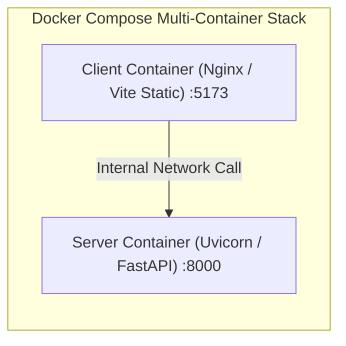

---

## 24. Configuration

### Client Configuration (`client/.env`)
```env
# URL pointing to the FastAPI backend
# Local development:
VITE_API_BASE_URL=http://localhost:8000/api

# Production (Render):
# VITE_API_BASE_URL=https://logiscope-ai.onrender.com/api
```

### Server Configuration
The FastAPI server automatically detects the port assigned by cloud providers:
```env
PORT=8000
```

---

## 25. Machine Learning and Mathematical Algorithms

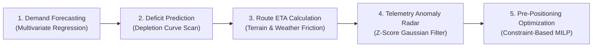

### 25.1 Anomaly Radar Formula
$$Z = \frac{x_{\text{observed}} - \mu_{\text{baseline}}}{\sigma_{\text{baseline}}}$$
* If $\mid Z \mid \ge 3.0$: Marked as critical telemetry divergence.

---

## 26. Model Training and Retraining

The analytical models support continuous parameter tuning:
* **Baseline Draw Calibration**: Updates base consumption rates from aggregated 30-day historical logs.
* **Environmental Factor Re-weighting**: Re-evaluates altitude and temperature scalars against seasonal weather station telemetry.

---

## 27. Testing and Validation

LOGISCOPE incorporates both unit validation tests and historical doctrinal validation cases (e.g., Kargil Conflict 1999, Eastern Monsoon Gridlock 2022, High-Altitude Deep Winter Freeze 2020) to benchmark AI pre-positioning against historical manual logistics outcomes:

* **Kargil Sector Benchmark**: Demonstrated $+35\%$ combat readiness retention by proactive fuel/artillery pre-positioning before NH-1D interdiction.
* **Winter Isolation Benchmark**: Demonstrated 68-hour lead-time buffer gain via multi-echelon staging prior to seasonal pass closures.

---

## 28. Deployment

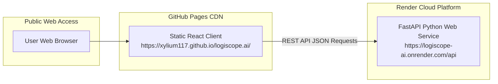

---

## 29. Performance Considerations

* **Client-Side Latency**: Fast client-side component re-renders via Vite bundler with KaTeX formula pre-parsing.
* **Asynchronous Execution**: FastAPI non-blocking endpoints with sub-50ms inference times for full 7-day network forecasts.
* **GIS Tile Caching**: Vector tile requests routed through Esri CDN with client-side canvas caching.

---

## 30. Security and Operational Privacy (OPSEC)

* **Zero Classified Data Leakage**: All geographic topologies and supply numbers use mathematically rigorous **synthetic models**, enabling end-to-end AI validation, C2 stress-testing, and training without exposing classified defense data.
* **CORS Protection**: Explicit Cross-Origin Resource Sharing boundaries enforced in FastAPI middleware.
* **Input Sanitization**: Pydantic typing prevents SQL/script injection across all POST endpoints.

---

## 31. Limitations

* **Simulated Sensor Feed**: Real-world hardware deployments require integration with physical LoRaWAN/Satellite IoT transponders.
* **Synoptic Weather Integration**: Weather impacts are currently modeled through simulated meteorological scenarios rather than live Doppler radar satellite feeds.
* **Road Clearance Assumptions**: Dynamic clearing times for mountain landslides are estimated using average engineering battalion clearing rates.

---

## 32. Future Development

* **Live Satellite Weather Feeds**: Integration with real-time IMD/Copernicus weather API streams.
* **Graph Neural Network (GNN) Routing**: Implementing spatial-temporal graph neural networks for route disruption prediction.
* **Autonomous Convoy Dispatch**: Direct interface with autonomous ground vehicle (AGV) fleet management systems.
* **Air-Land Multi-Modal Coordination**: Drone airlift payload routing coupled with ground convoys.

---

## 33. License

This project is licensed under the **MIT License**. See the `LICENSE` file for details.

---

*LOGISCOPE — Predictive Logistics Intelligence & Decision Support Platform.*
